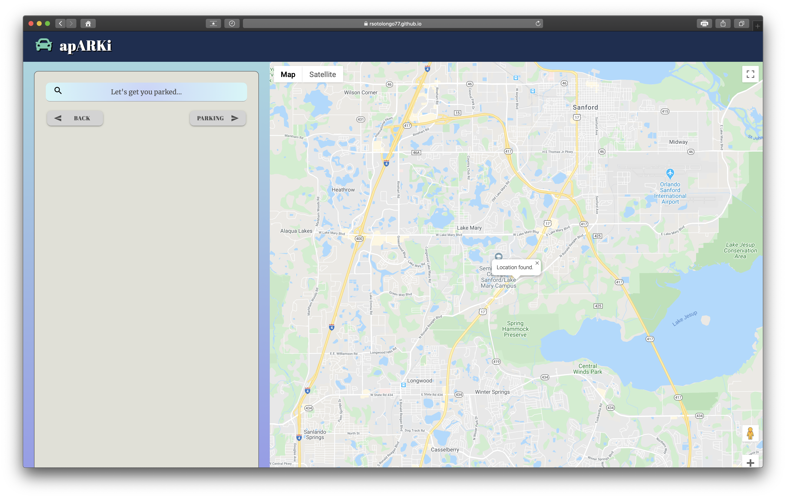
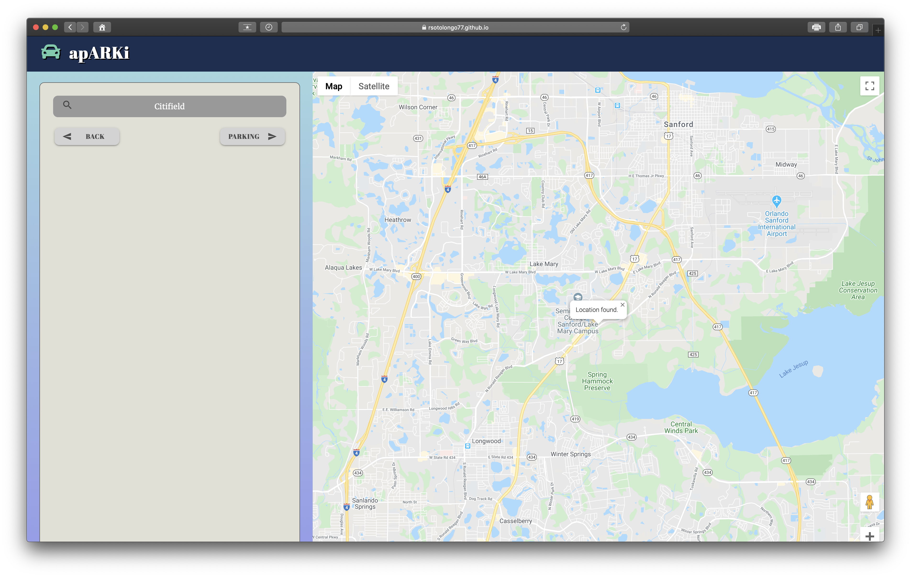
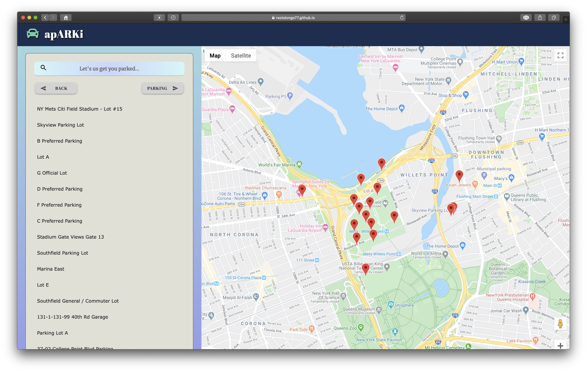
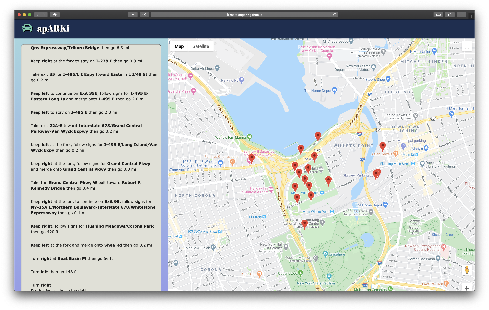

# apARKi

## apARKi is an assistant that helps you find a parking space.

 ## [apARKi Deployed Version Click here](https://rsotolongo77.github.io/apARKi/)

apARKi uses Google Maps API to find your location

Use the search bar to search for a specific venue
* Enter any address
* Enter any location nationwide

 

apARKi will find all parking areas with in 1000 meters of your destination
* Parking areas are listed on the left
* Parking areas are pinned on the map

Click on the parking structure and you will be given directions to the parking structure of your choice
* Directions are displayed on an easy to use GIU

Authors:
  - [Eddie Allard](Https://www.theallardompany.com)
  - [Ricky Sotolongo](https://github.com/Rsotolongo77)
  - [Chad Kaplan](https://github.com/Chadkaplan)
  - [Sid Hicks](https://sidh80.github.io/)

  ## Technologies Used

- HTML5
- JavaScript
- CSS3
- Google Maps API
- Google Places API
- Google Directions API
- Materialize
- jQuery

